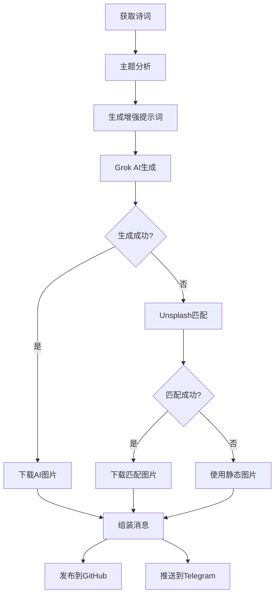
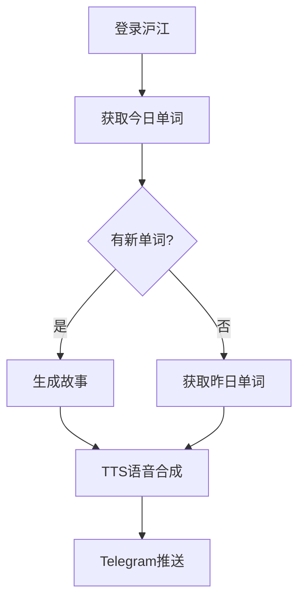

# Moning 系统设计文档

## 系统概述

Moning 是一个智能化的个人习惯养成系统，通过多模态内容生成和多平台分发，实现早起打卡和单词学习的数字化仪式感。

## 核心设计哲学

### 1. 优雅降级 (Graceful Degradation)
系统采用多层降级策略，确保在任何情况下都能提供基础服务：
```
AI生成内容 → API获取内容 → 静态备选内容 → 基础文本内容
```

### 2. 多模态融合 (Multimodal Integration)
- **视觉**: AI生成图片 + 智能匹配图片
- **文本**: 古诗词 + 年度进度 + 学习内容
- **音频**: TTS语音合成
- **数据**: GitHub Issues + Telegram消息

### 3. 认知外化 (Cognitive Externalization)
将个人习惯、学习进度、创作内容外化为可检索、可分享的数字资产。

## 架构设计

### 系统架构图
```
┌─────────────────┐    ┌─────────────────┐
│   Content Gen   │    │   Learning Sys  │
│   (get_up.py)   │    │  (cichang.py)   │
└─────────┬───────┘    └─────────┬───────┘
          │                      │
          ▼                      ▼
┌─────────────────────────────────────────┐
│           AI Services Layer             │
│  ┌─────────┐ ┌─────────┐ ┌─────────┐   │
│  │  Grok   │ │ OpenAI  │ │Unsplash │   │
│  │   AI    │ │   API   │ │   API   │   │
│  └─────────┘ └─────────┘ └─────────┘   │
└─────────────────┬───────────────────────┘
                  │
                  ▼
┌─────────────────────────────────────────┐
│         Distribution Layer              │
│  ┌─────────┐ ┌─────────┐ ┌─────────┐   │
│  │ GitHub  │ │Telegram │ │  Local  │   │
│  │ Issues  │ │   Bot   │ │ Storage │   │
│  └─────────┘ └─────────┘ └─────────┘   │
└─────────────────────────────────────────┘
```

### 核心模块设计

#### 1. 内容生成引擎 (Content Generation Engine)
**职责**: 智能内容创作与多媒体生成

**关键组件**:
- `PoetryAnalyzer`: 诗词主题分析
- `ImageGenerator`: 多源图片生成
- `PromptEnhancer`: 提示词优化
- `FallbackManager`: 降级策略管理

**设计决策**:
- **异步重试机制**: 指数退避策略，最大3次重试
- **主题驱动生成**: 基于诗词语义分析选择视觉风格
- **多源融合**: AI生成 + API匹配 + 静态备选的三层保障

#### 2. 学习系统 (Learning System)
**职责**: 个性化学习内容生成与分发

**关键组件**:
- `VocabularyFetcher`: 沪江小D API集成
- `StoryGenerator`: AI驱动的故事创作
- `AudioSynthesizer`: 多语言TTS合成
- `ProgressTracker`: 学习进度跟踪

**设计决策**:
- **情境化学习**: 将单词融入故事情境
- **多感官刺激**: 文字 + 语音的双重强化
- **渐进式难度**: 基于学习历史调整内容复杂度

#### 3. 分发系统 (Distribution System)
**职责**: 多平台内容发布与状态同步

**关键组件**:
- `GitHubPublisher`: Issue评论发布
- `TelegramBot`: 多媒体消息推送
- `LocalArchiver`: 本地存储管理
- `StatusSynchronizer`: 跨平台状态同步

## 数据流设计

### 早起打卡流程


### 单词学习流程


## 关键设计决策

### 1. API集成策略
**决策**: 多API并行 + 智能降级
**理由**:
- 单一API的可靠性风险
- 不同API的内容质量差异
- 成本控制需求

**实现**:
```python
# 优先级链设计
def get_image_with_fallback(prompt):
    sources = [
        (generate_grok_image, "AI生成"),
        (get_unsplash_image, "智能匹配"),
        (get_static_image, "静态备选")
    ]

    for source_func, source_type in sources:
        try:
            result = source_func(prompt)
            if result:
                return result, source_type
        except Exception as e:
            logger.warning(f"{source_type} failed: {e}")

    raise Exception("All image sources failed")
```

### 2. 状态管理策略
**决策**: 基于时间的幂等性检查
**理由**:
- 避免重复执行
- 支持手动重试
- 简化状态逻辑

**实现**:
```python
def get_today_status(issue):
    """基于GitHub Issue评论的时间戳判断今日状态"""
    latest_comment = get_latest_comment(issue)
    if not latest_comment:
        return False

    comment_date = parse_comment_date(latest_comment)
    today = get_today()

    return comment_date.date() == today.date()
```

### 3. 配置管理策略
**决策**: 环境变量 + 默认值 + 运行时参数
**理由**:
- 安全性（敏感信息不入代码）
- 灵活性（支持多环境部署）
- 可测试性（支持mock配置）

## 性能考量

### 1. 并发控制
- **图片生成**: 串行执行，避免API限流
- **内容发布**: 并行执行，提升用户体验
- **重试机制**: 指数退避，避免雪崩效应

### 2. 资源管理
- **本地存储**: 按日期分目录，便于清理
- **内存使用**: 流式处理大文件，避免OOM
- **网络请求**: 超时控制 + 连接池复用

### 3. 错误恢复
- **部分失败容忍**: 图片失败不影响文字发布
- **状态一致性**: 基于外部状态（GitHub）判断执行状态
- **人工干预**: 支持dry-run模式进行调试

## 扩展性设计

### 1. 插件化架构
```python
class ContentGenerator:
    def __init__(self):
        self.plugins = []

    def register_plugin(self, plugin):
        self.plugins.append(plugin)

    def generate(self, context):
        for plugin in self.plugins:
            context = plugin.process(context)
        return context
```

### 2. 配置驱动
```yaml
# config.yaml
generators:
  - type: "poetry"
    api: "jinrishici"
    fallback: "static_poems.json"

  - type: "image"
    sources:
      - name: "grok"
        priority: 1
        config: {...}
      - name: "unsplash"
        priority: 2
        config: {...}
```

### 3. 事件驱动
```python
class EventBus:
    def emit(self, event_type, data):
        for handler in self.handlers[event_type]:
            handler(data)

# 使用示例
bus.emit('content_generated', {
    'type': 'poetry',
    'content': poem,
    'metadata': {...}
})
```

## 安全考量

### 1. API密钥管理
- 环境变量存储
- 运行时验证
- 最小权限原则

### 2. 输入验证
- API响应格式验证
- 文件类型检查
- 内容长度限制

### 3. 错误信息脱敏
- 敏感信息过滤
- 结构化日志
- 分级错误处理

## 监控与可观测性

### 1. 关键指标
- **成功率**: 各API的调用成功率
- **响应时间**: 端到端处理时间
- **降级频率**: 各降级策略的触发频率
- **用户参与度**: GitHub/Telegram的互动数据

### 2. 日志策略
- **结构化日志**: JSON格式，便于分析
- **分级记录**: DEBUG/INFO/WARN/ERROR
- **上下文追踪**: 请求ID贯穿整个流程

### 3. 告警机制
- **API异常**: 连续失败告警
- **存储空间**: 磁盘使用率监控
- **依赖服务**: 外部服务可用性检查

## 未来演进方向

### 1. 智能化升级
- **个性化推荐**: 基于历史偏好的内容推荐
- **情感分析**: 根据用户状态调整内容风格
- **自适应调度**: 基于用户行为优化推送时间

### 2. 社交化扩展
- **社区分享**: 优质内容的社区传播
- **协作学习**: 多人学习小组功能
- **成就系统**: 游戏化的激励机制

### 3. 平台化发展
- **开放API**: 第三方集成接口
- **插件市场**: 社区贡献的功能扩展
- **多租户支持**: SaaS化部署能力

---

*本文档将随系统演进持续更新，确保设计决策的可追溯性和架构演进的连续性。*