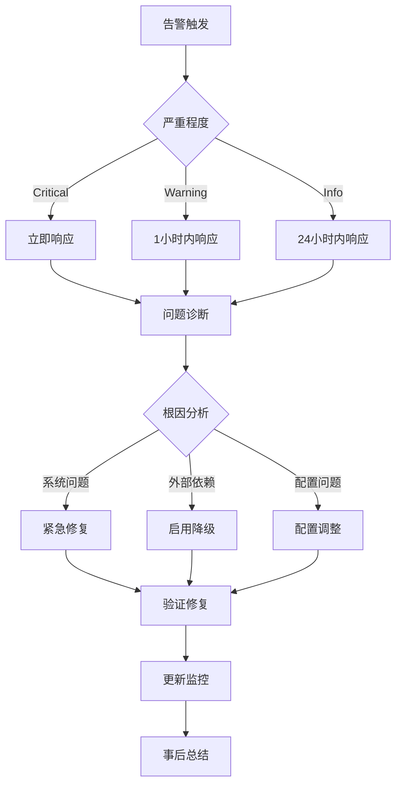

# Moning 系统指标与监控策略

## 核心指标体系

### 1. 业务指标 (Business Metrics)

#### 用户参与度指标
- **日活跃度** (Daily Active Usage)
  - 指标: 每日成功打卡次数
  - 目标: > 90% (考虑到个人使用场景)
  - 数据源: GitHub Issue 评论时间戳

- **内容质量满意度** (Content Quality Score)
  - 指标: AI生成内容 vs 降级内容的比例
  - 目标: AI生成内容 > 70%
  - 计算: `ai_generated_count / total_content_count * 100`

- **学习连续性** (Learning Continuity)
  - 指标: 连续学习天数
  - 目标: 7天连续率 > 80%
  - 数据源: 单词学习记录

#### 习惯养成效果指标
- **早起一致性** (Wake-up Consistency)
  - 指标: 早起时间的标准差
  - 目标: 标准差 < 30分钟
  - 计算: `std_dev(wake_up_times)`

- **内容创作频率** (Content Creation Frequency)
  - 指标: 每周生成的多媒体内容数量
  - 目标: > 5个/周 (图片+音频+文字)

### 2. 技术指标 (Technical Metrics)

#### 系统可靠性指标
- **端到端成功率** (End-to-End Success Rate)
  ```
  指标定义: 完整流程执行成功的比例
  计算公式: successful_executions / total_executions * 100
  目标值: > 95%
  监控周期: 实时 + 日报
  ```

- **API可用性矩阵** (API Availability Matrix)
  ```
  Grok API:     目标 > 90%  (新服务，容忍度较高)
  OpenAI API:   目标 > 99%  (核心依赖)
  Unsplash API: 目标 > 95%  (备选服务)
  沪江API:      目标 > 90%  (第三方服务)
  ```

- **降级策略触发率** (Fallback Trigger Rate)
  ```
  一级降级 (Grok->Unsplash): < 30%
  二级降级 (Unsplash->Static): < 10%
  三级降级 (完全失败): < 1%
  ```

#### 性能指标
- **响应时间分布** (Response Time Distribution)
  ```
  P50: < 30秒  (图片生成主导)
  P90: < 60秒  (包含重试)
  P99: < 120秒 (极端情况)
  ```

- **资源使用效率** (Resource Utilization)
  ```
  磁盘使用: < 1GB/月 (图片存储)
  内存峰值: < 512MB (图片处理)
  网络带宽: < 100MB/天 (API调用+图片下载)
  ```

#### 错误率指标
- **分类错误率** (Categorized Error Rate)
  ```
  网络错误: < 5%   (重试可解决)
  API限流:  < 2%   (需要优化调用频率)
  解析错误: < 1%   (代码质量问题)
  系统错误: < 0.5% (严重问题)
  ```

### 3. 质量指标 (Quality Metrics)

#### 内容质量指标
- **图片主题匹配度** (Image-Poetry Relevance)
  - 测量方法: 人工评分 + AI语义相似度
  - 目标: 相关性评分 > 7/10
  - 采样频率: 每周随机抽样10个

- **诗词多样性** (Poetry Diversity)
  - 指标: 30天内重复诗词的比例
  - 目标: 重复率 < 10%
  - 计算: `duplicate_poems / total_poems * 100`

- **语音质量** (Audio Quality)
  - 指标: TTS生成成功率
  - 目标: > 98%
  - 监控: 文件大小 + 时长合理性检查

#### 用户体验指标
- **消息发送及时性** (Message Delivery Timeliness)
  ```
  GitHub发布: < 5秒
  Telegram推送: < 10秒
  总体延迟: < 2分钟
  ```

- **多媒体完整性** (Multimedia Completeness)
  ```
  图片+文字: 100% (基础要求)
  图片+文字+音频: > 90% (完整体验)
  ```

## 监控实现策略

### 1. 指标收集架构

#### 埋点设计
```python
class MetricsCollector:
    def __init__(self):
        self.metrics = {}
        self.start_time = time.time()

    def record_api_call(self, api_name, success, response_time):
        """记录API调用指标"""
        key = f"api.{api_name}"
        self.metrics.setdefault(key, []).append({
            'timestamp': time.time(),
            'success': success,
            'response_time': response_time
        })

    def record_content_generation(self, content_type, source, quality_score):
        """记录内容生成指标"""
        self.metrics.setdefault('content_generation', []).append({
            'timestamp': time.time(),
            'type': content_type,
            'source': source,
            'quality': quality_score
        })

    def record_user_engagement(self, action, platform):
        """记录用户参与指标"""
        self.metrics.setdefault('user_engagement', []).append({
            'timestamp': time.time(),
            'action': action,
            'platform': platform
        })
```

#### 数据存储策略
```python
# 本地文件存储 (简单场景)
class LocalMetricsStorage:
    def save_daily_metrics(self, date, metrics):
        filepath = f"metrics/{date}.json"
        with open(filepath, 'w') as f:
            json.dump(metrics, f, indent=2)

# 时序数据库存储 (扩展场景)
class TimeSeriesStorage:
    def write_metric(self, metric_name, value, tags=None):
        # InfluxDB/Prometheus 集成
        pass
```

### 2. 实时监控实现

#### 健康检查端点
```python
@app.route('/health')
def health_check():
    """系统健康状态检查"""
    checks = {
        'api_connectivity': check_api_connectivity(),
        'disk_space': check_disk_space(),
        'last_execution': check_last_execution_time(),
        'error_rate': calculate_recent_error_rate()
    }

    overall_health = all(checks.values())
    status_code = 200 if overall_health else 503

    return jsonify({
        'status': 'healthy' if overall_health else 'unhealthy',
        'checks': checks,
        'timestamp': time.time()
    }), status_code
```

#### 指标聚合
```python
class MetricsAggregator:
    def calculate_success_rate(self, time_window='24h'):
        """计算指定时间窗口的成功率"""
        end_time = time.time()
        start_time = end_time - self.parse_time_window(time_window)

        total_executions = self.count_executions(start_time, end_time)
        successful_executions = self.count_successful_executions(start_time, end_time)

        return successful_executions / total_executions if total_executions > 0 else 0

    def calculate_p99_response_time(self, api_name, time_window='24h'):
        """计算API响应时间的P99值"""
        response_times = self.get_response_times(api_name, time_window)
        return np.percentile(response_times, 99) if response_times else 0
```

### 3. 告警机制

#### 告警规则定义
```yaml
# alerts.yaml
alerts:
  - name: "high_error_rate"
    condition: "error_rate > 0.05"
    duration: "5m"
    severity: "warning"
    message: "错误率超过5%，当前值: {{.value}}"

  - name: "api_down"
    condition: "api_success_rate < 0.8"
    duration: "2m"
    severity: "critical"
    message: "{{.api_name}} API可用性低于80%"

  - name: "content_generation_failure"
    condition: "ai_generation_rate < 0.5"
    duration: "10m"
    severity: "warning"
    message: "AI内容生成成功率低于50%"

  - name: "disk_space_low"
    condition: "disk_usage > 0.9"
    duration: "1m"
    severity: "critical"
    message: "磁盘使用率超过90%"
```

#### 告警通道
```python
class AlertManager:
    def __init__(self):
        self.channels = [
            TelegramAlertChannel(),
            EmailAlertChannel(),
            LogAlertChannel()
        ]

    def send_alert(self, alert_type, message, severity):
        """发送告警到所有配置的通道"""
        for channel in self.channels:
            if channel.should_send(severity):
                channel.send(alert_type, message, severity)

class TelegramAlertChannel:
    def send(self, alert_type, message, severity):
        emoji = "🚨" if severity == "critical" else "⚠️"
        formatted_message = f"{emoji} [{severity.upper()}] {alert_type}\n{message}"
        self.bot.send_message(self.admin_chat_id, formatted_message)
```

### 4. 仪表板设计

#### 关键指标仪表板
```
┌─────────────────────────────────────────────────────────────┐
│                    Moning 系统监控仪表板                      │
├─────────────────────────────────────────────────────────────┤
│ 系统状态: 🟢 健康    │ 最后执行: 2分钟前    │ 今日成功率: 98.5% │
├─────────────────────────────────────────────────────────────┤
│                        API 状态监控                          │
│ ┌─────────┐ ┌─────────┐ ┌─────────┐ ┌─────────┐           │
│ │ Grok AI │ │ OpenAI  │ │Unsplash │ │ 沪江API │           │
│ │  🟢 95% │ │ 🟢 99%  │ │ 🟢 97%  │ │ 🟡 89%  │           │
│ └─────────┘ └─────────┘ └─────────┘ └─────────┘           │
├─────────────────────────────────────────────────────────────┤
│                      内容生成统计                            │
│ AI生成图片: 73% │ 智能匹配: 22% │ 静态备选: 5%              │
│ 语音合成: 96%   │ 诗词获取: 99% │ 故事生成: 91%             │
├─────────────────────────────────────────────────────────────┤
│                      性能指标                               │
│ 平均响应时间: 28s │ P99响应时间: 85s │ 错误率: 1.2%        │
│ 磁盘使用: 234MB   │ 内存峰值: 128MB  │ 网络流量: 45MB/天   │
└─────────────────────────────────────────────────────────────┘
```

## 数据分析与洞察

### 1. 趋势分析
```python
class TrendAnalyzer:
    def analyze_usage_pattern(self, days=30):
        """分析使用模式趋势"""
        daily_usage = self.get_daily_usage(days)

        # 计算趋势
        trend = self.calculate_linear_trend(daily_usage)
        seasonality = self.detect_weekly_pattern(daily_usage)

        return {
            'trend': trend,  # 上升/下降/稳定
            'seasonality': seasonality,  # 周几使用率最高
            'consistency': self.calculate_consistency_score(daily_usage)
        }

    def analyze_content_preference(self):
        """分析内容偏好"""
        poetry_themes = self.get_poetry_themes()
        image_styles = self.get_image_styles()

        return {
            'preferred_themes': Counter(poetry_themes).most_common(5),
            'preferred_styles': Counter(image_styles).most_common(5),
            'diversity_score': self.calculate_diversity_score(poetry_themes)
        }
```

### 2. 异常检测
```python
class AnomalyDetector:
    def detect_performance_anomalies(self):
        """检测性能异常"""
        recent_metrics = self.get_recent_metrics(hours=24)
        baseline_metrics = self.get_baseline_metrics(days=7)

        anomalies = []

        # 响应时间异常
        if recent_metrics['avg_response_time'] > baseline_metrics['avg_response_time'] * 2:
            anomalies.append({
                'type': 'performance',
                'metric': 'response_time',
                'severity': 'high',
                'current': recent_metrics['avg_response_time'],
                'baseline': baseline_metrics['avg_response_time']
            })

        return anomalies

    def detect_content_quality_drift(self):
        """检测内容质量漂移"""
        recent_quality = self.get_recent_quality_scores()
        historical_quality = self.get_historical_quality_scores()

        # 使用统计检验检测显著性差异
        statistic, p_value = stats.ttest_ind(recent_quality, historical_quality)

        if p_value < 0.05 and np.mean(recent_quality) < np.mean(historical_quality):
            return {
                'drift_detected': True,
                'severity': 'medium',
                'current_avg': np.mean(recent_quality),
                'historical_avg': np.mean(historical_quality)
            }

        return {'drift_detected': False}
```

### 3. 预测性分析
```python
class PredictiveAnalytics:
    def predict_api_failure_risk(self):
        """预测API失败风险"""
        # 基于历史数据训练简单的预测模型
        features = self.extract_features()  # 时间、负载、历史成功率等
        failure_risk = self.failure_prediction_model.predict(features)

        return {
            'risk_score': failure_risk,
            'risk_level': self.categorize_risk(failure_risk),
            'recommended_actions': self.get_risk_mitigation_actions(failure_risk)
        }

    def forecast_resource_usage(self, days_ahead=7):
        """预测资源使用量"""
        historical_usage = self.get_historical_resource_usage()

        # 简单的线性预测
        forecast = self.time_series_forecast(historical_usage, days_ahead)

        return {
            'disk_usage_forecast': forecast['disk'],
            'bandwidth_forecast': forecast['bandwidth'],
            'alerts': self.check_forecast_thresholds(forecast)
        }
```

## 监控运维流程

### 1. 日常监控检查清单
```markdown
## 每日检查 (自动化)
- [ ] 系统健康状态检查
- [ ] 关键指标阈值检查
- [ ] 错误日志审查
- [ ] 资源使用情况检查

## 每周检查 (半自动化)
- [ ] 趋势分析报告生成
- [ ] 性能基线更新
- [ ] 容量规划评估
- [ ] 用户满意度分析

## 每月检查 (手动)
- [ ] 监控策略有效性评估
- [ ] 告警规则优化
- [ ] 指标体系完善
- [ ] 监控工具升级评估
```

### 2. 事件响应流程


### 3. 持续改进机制
```python
class MonitoringOptimizer:
    def optimize_alert_thresholds(self):
        """基于历史数据优化告警阈值"""
        false_positive_rate = self.calculate_false_positive_rate()

        if false_positive_rate > 0.1:  # 10%以上的误报率
            # 调整阈值以减少误报
            self.adjust_thresholds(direction='increase', factor=1.2)

        missed_incident_rate = self.calculate_missed_incident_rate()

        if missed_incident_rate > 0.05:  # 5%以上的漏报率
            # 调整阈值以减少漏报
            self.adjust_thresholds(direction='decrease', factor=0.9)

    def evaluate_monitoring_effectiveness(self):
        """评估监控有效性"""
        metrics = {
            'mttr': self.calculate_mean_time_to_resolution(),
            'mtbf': self.calculate_mean_time_between_failures(),
            'alert_accuracy': self.calculate_alert_accuracy(),
            'coverage': self.calculate_monitoring_coverage()
        }

        recommendations = self.generate_improvement_recommendations(metrics)

        return {
            'current_metrics': metrics,
            'recommendations': recommendations,
            'priority_actions': self.prioritize_actions(recommendations)
        }
```

---

*本监控策略将根据系统运行情况和业务需求持续优化，确保监控体系的有效性和实用性。*